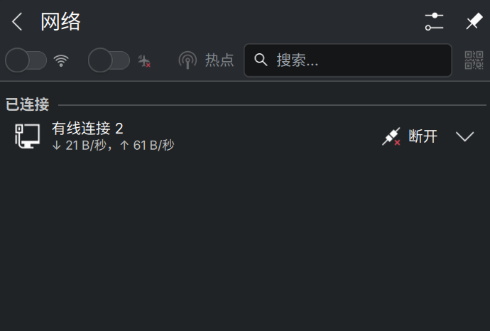

首先是机械革命无界14Xpro的配置：

- **OS**: CachyOS x86_64
- **Kernel**: Linux 6.19.6-2-cachyos
- **CPU**: AMD Ryzen AI 9 H 365 (20) @ 5.09 GHz
- **GPU**: AMD Radeon 880M Graphics [Integrated]
- **Display**: 14" 2880x1800 @ 1.6x, 60 Hz [Built-in]
- **Memory**: 32 GB (29.15 GiB usable)
- **Disk**: 1 TB btrfs (949.77 GiB total)
- **DE**: KDE Plasma 6.6.2 (Wayland)
- **WM**: KWin

这是一套非常强大的轻薄本配置，尤其是 Ryzen AI 9 H 365 处理器结合 880M 核显，在 Linux 下的性能表现值得期待。

具体的安装过程不做过多赘述，网上有很多教程，这里主要记录一些踩坑点。

## 1. 关闭 Secure Boot

鸡哥的本子如果直接按 F2 进 BIOS，是无法找到关闭 Secure Boot 的选项的，需要在开机时按 ESC 键，进入 BIOS 菜单，才能关闭 Secure Boot。

## 2. 无线网卡

鸡哥自带的无线网卡是 AX210，我安装 CachyOS 后，无线无法开启，只有蓝牙正常。具体表现如下：

```shell
0: hci0: Bluetooth
        Soft blocked: no
        Hard blocked: no
1: phy0: Wireless LAN
        Soft blocked: no
        Hard blocked: yes
```

具体表现如图所示，无法打开 Wi-Fi：



网上也查了一下 [这篇博客](https://www.cnblogs.com/JRobot/p/18586568.html)，这个似乎是鸡哥的问题。后续打算换一张 RZ616，希望可以解决吧。

## 3. 指纹模块

由于本人纯小白，目前还没解决，也不知道怎么解决，后续有进展再更新吧。

---
最后说明一下，我用的是 KDE 桌面，目前其他快捷键啥的都还正常，休眠也正常，一晚上掉电 10% 左右，还算可以吧。主要实在是不喜欢 Windows 了，台式机用的也是 CachyOS，按照我目前的使用来说一切正常。平时我就玩玩《炉石传说》和《NBA 2K》，表现都很稳定。另外提一嘴，炉石传说需要开启 WoW64 支持就不会闪退了。

先就这样吧，后续有进展继续更新。
